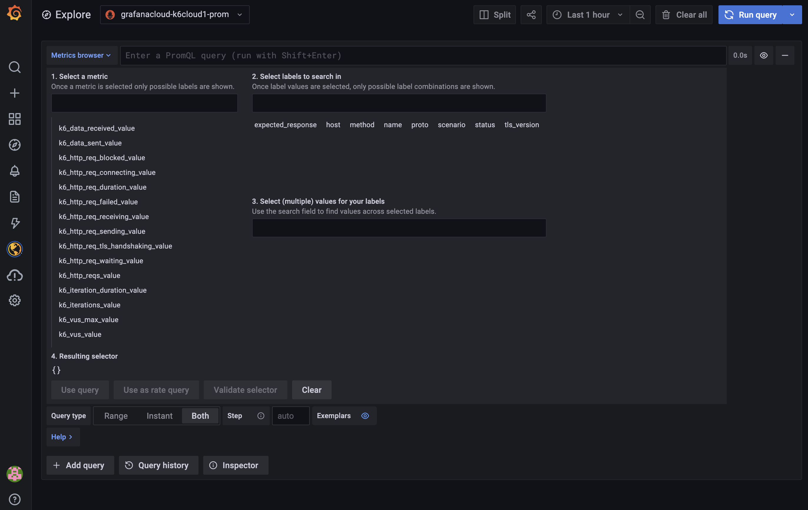

With this integration, you can export test result metrics from the k6 Cloud to a Prometheus instance hosted by [Grafana Cloud](https://grafana.com/products/cloud/), allowing you to use Grafana to query, visualize, and correlate k6 metrics with all your other metrics. 

> ⭐️  &nbsp;[Cloud APM](/cloud/integrations/cloud-apm/) integrations are available on Pro and Enterprise plans, as well as the annual Team plan and Trial.

## Grafana Cloud settings

If you do not have a Grafana Cloud account, you can sign up [here](https://grafana.com/products/cloud/). The free plan includes 10,000 Prometheus series.

To set up the integration on the k6 Cloud, you need the following data from your Grafana Cloud Prometheus instance:

- URL
- Username
- Password

Log in to Grafana.com and visit the [Cloud Portal](https://grafana.com/docs/grafana-cloud/what-are/cloud-portal/). Click on the `Details` button of your Prometheus service.


Copy the URL of the Remote Write Endpoint and the Username / Instance ID. 

For the password, create and copy an API key of `MetricsPublisher` role.


Now, you can set the URL, username, and password on the k6 Cloud to authorize exporting k6 Cloud metrics to your Prometheus instance.

## k6 Cloud test configuration

You have to set up the Grafana Cloud settings for each test that you want to export its test result metrics when running the test.

Currently, there are two options to set up the Cloud APM settings in the test:

- [Using the test builder](#configuration-using-the-test-builder)
- [Scripting the k6 test](#configuration-in-the-k6-script)  


### Configuration using the test builder

First, you have to enable the Grafana Cloud integration into your organization. Click the `Cloud APM` option on the left sidebar menu under the `Manage` section, and select `Grafana Cloud` from the list.


In this form, set the URL, username, and password that you copied previously.  For more information on the other input fields, see [configuration parameters](#configuration-parameters).

Save the Grafana Cloud configuration for the current organization. 

Now, you can use the [test builder](/test-authoring/test-builder) to enable the integration for a new or existing test on the organization.


### Configuration in the k6 script

If you script your k6 tests, you can also configure the Cloud APM settings using the `apm` option in the k6 script. 

The parameters to export the k6 metrics to a Grafana Cloud Prometheus instance are as follows:

```javascript
export let options = {
  ext: {
    loadimpact: {
      apm: [
        {
          provider: "prometheus",
          remoteWriteURL: "<Remote Write URL>", 
          credentials: {
            username: "<Prometheus Username / Instance ID>",
            password: "<Grafana Cloud API key of type MetricsPublisher>"
          },
          // optional parameters
          metrics: ["http_req_sending", "my_rate", "my_gauge", ...],
          includeDefaultMetrics: true,
          includeTestRunId: false
        },
      ]
    },
  },
};
```

### Configuration parameters

| Name                    | Description                                                                                                                                                                                |
| ----------------------- | ------------------------------------------------------------------------------------------------------------------------------------------------------------------------------------------ |
| provider<sup>(required)</sup>            | For this integration, the value must be `prometheus`.
| remoteWriteURL<sup>(required)</sup>        | URL of the Prometheus remote write endpoint. <br/> For example: `https://prometheus-us-central1.grafana.net/api/prom/push`.                                                                                                |
| credentials<sup>(required)</sup>         | The credentials to authenticate with the Grafana Cloud Prometheus instance. The required parameters are: <br/> - username: the Prometheus username or instance ID. <br/> - password: a Grafana Cloud API key of type `MetricsPublisher`. |
| includeDefaultMetrics | Whether it exports the [default APM metrics](/cloud/integrations/cloud-apm/#default-apm-metrics): `data_sent`, `data_received`, `http_req_duration`, `http_reqs`, `iterations`, and `vus`. Default is `true`. |
| metrics               | List of built-in and custom metrics to export. <br/> Metric names are validated against the [Prometheus metric name conventions](https://prometheus.io/docs/concepts/data_model/#metric-names-and-labels)—ignoring nonconforming metrics.                                      |
| includeTestRunId      | Whether all the exported metrics include a `test_run_id` tag whose value is the k6 Cloud test run id. Default is `false`. <br/> Be aware that enabling this setting might increase the cost of your APM provider. |
| resampleRate          | The rate by which the metrics are resampled and sent to the APM provider in seconds. Default is 3 and acceptable values are integers between 1 and 10. |


## Run the cloud test

Once you have set up the Grafana Cloud settings in the test, you can run a cloud test as usual. The k6 Cloud will continuously export the test results metrics to the Prometheus endpoint during the test execution.

To test the integration, use the Prometheus query field to find k6 metrics. 

  

You can now start using all Grafana visualization capabilities for the k6 metrics. And correlate k6 metrics with other metrics of your systems to get better insights into what happens during your tests. 

## See also

- [Grafana Plugin](/cloud/integrations/grafana-plugin/)
- [Cloud APM](/cloud/integrations/cloud-apm/)